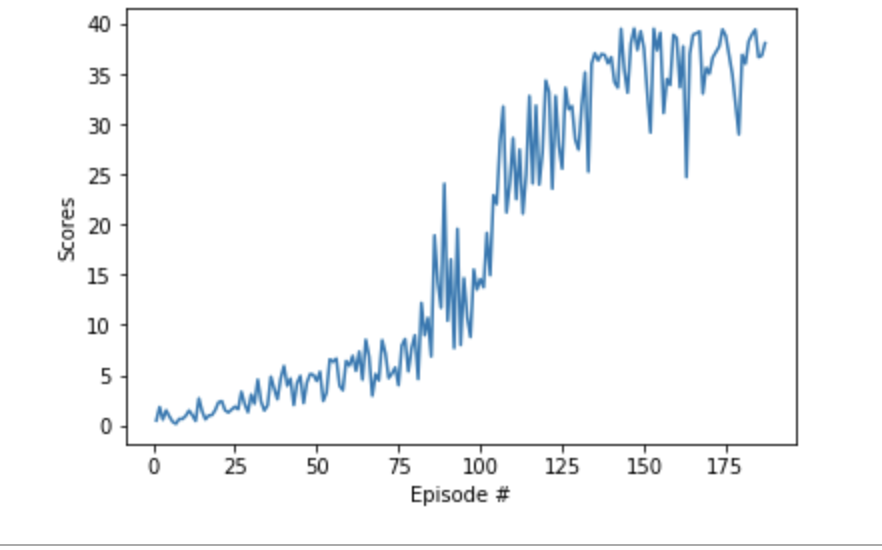

# Continuous Control

## Project's goal

In this project, creating an agent for double-jointed arm which can move to target locations. The agent trained with DDPG algorithm.
The goal of your agent is to maintain its position at the target location for as many time steps as possible.
Detailed explanation is available in [report file](https://github.com/aylingizem/Continuous_Control/blob/master/report.pdf)


## Project Details
* A reward of +0.1 is provided for each step that the agent's hand is in the goal location. 
* The observation space consists of 33 variables corresponding to position, rotation, velocity, and angular velocities of the arm. 
* Each action is a vector with four numbers, corresponding to torque applicable to two joints. 
* To solve the environment, the agent must get an average score of +30 over 100 consecutive episodes.
* Reacher Environment that belongs to the [Unity ML-Agents](https://github.com/Unity-Technologies/ml-agents/blob/master/docs/Learning-Environment-Examples.md#reacher) used as a learning environment.

## Instructions 

1. To install the requirements
```
pip install -r requirements.txt
```
2. Download the [Reacher Environment](https://github.com/Unity-Technologies/ml-agents/blob/master/docs/Learning-Environment-Examples.md#reacher)

3. run the [Continuous_Control.ipynb](https://github.com/aylingizem/Continuous_Control/blob/master/Continuous_Control.ipynb)

## Conclusion



In this scenario,

* Environment solved in 187 episodes and the average score is  30.21
